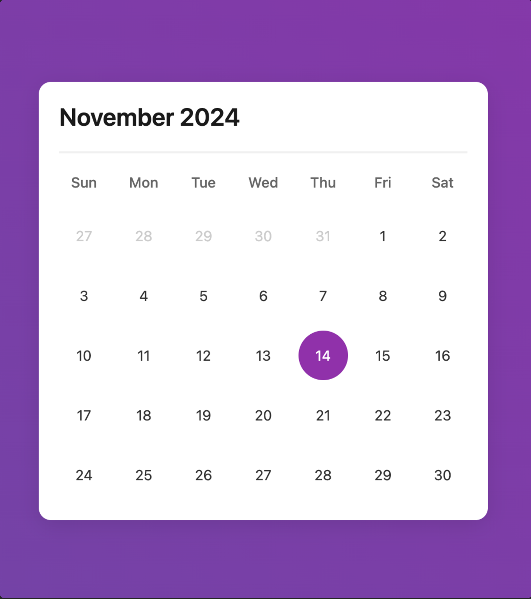
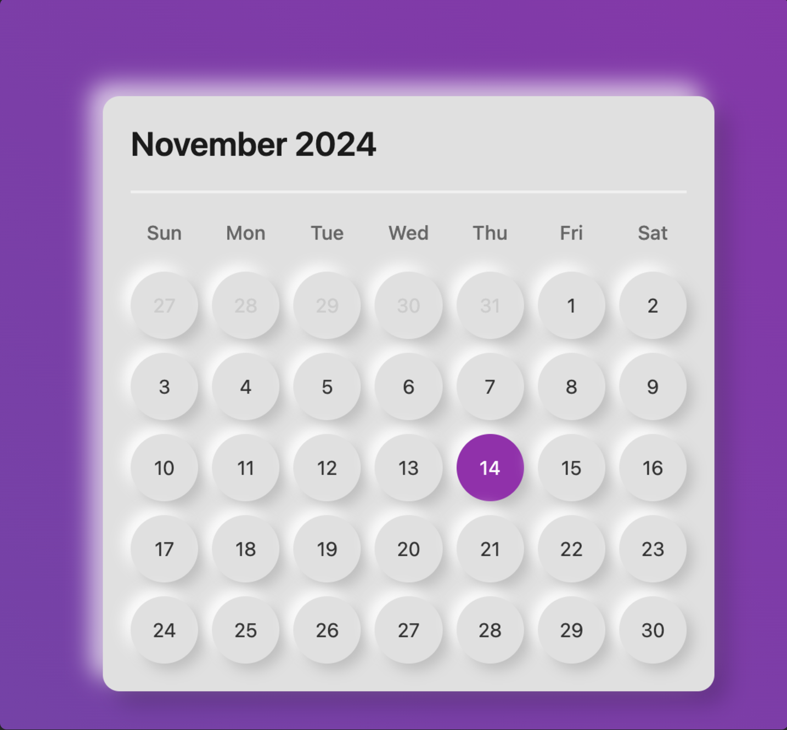
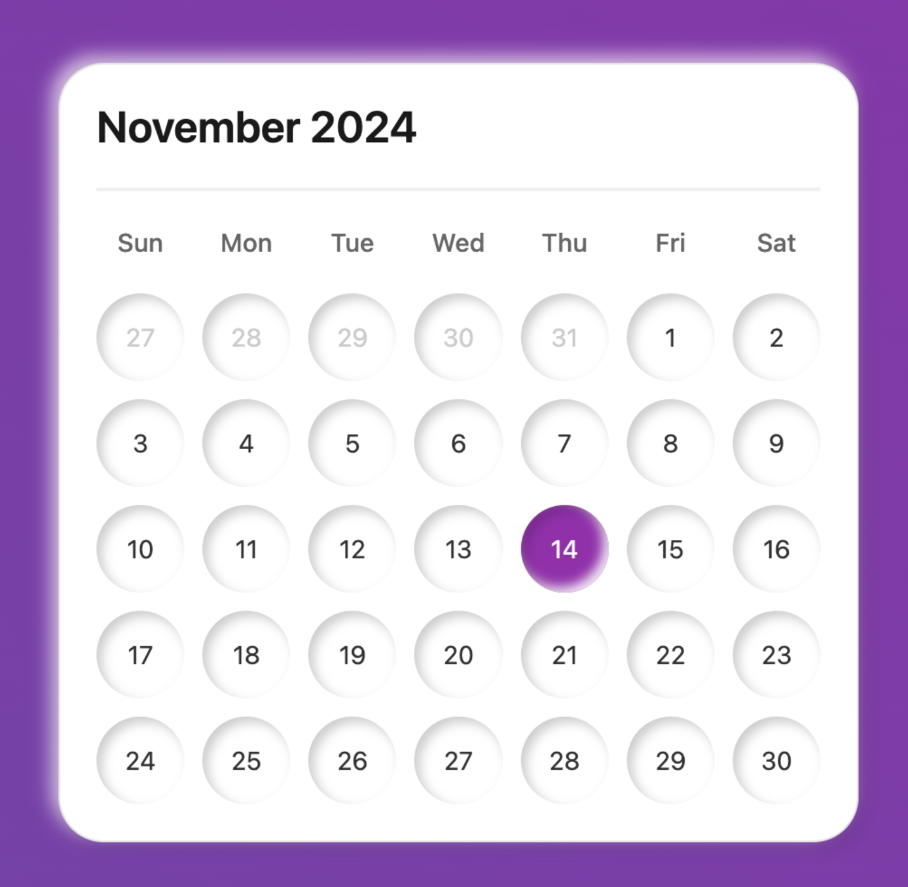
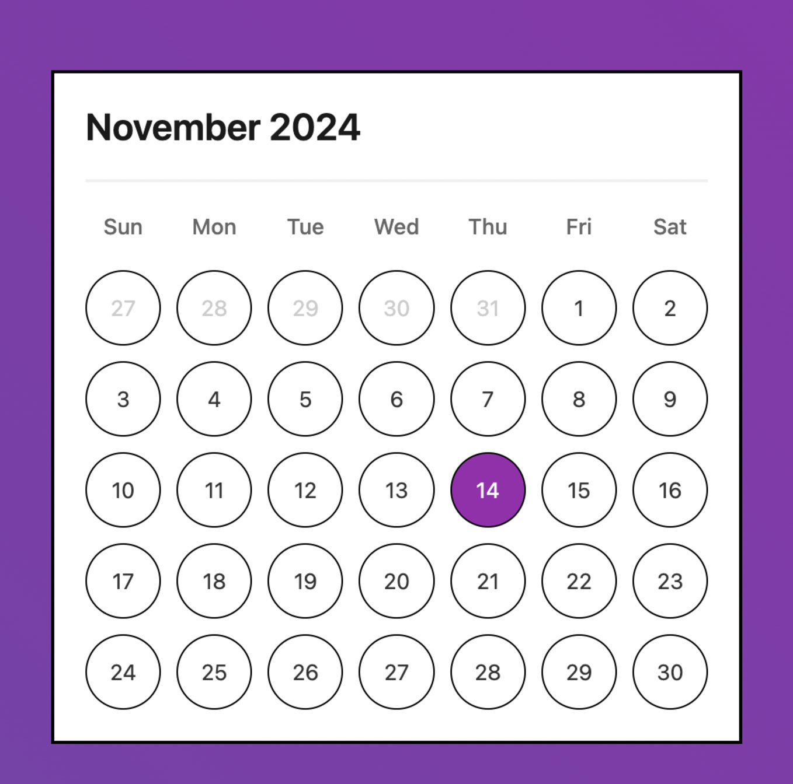

I'm a developer at heart, so when I'm working on a personal project, the hardest part isn't writing code—it's making design decisions. I recently built a calendar user interface. I wanted to enhance its visual appeal, so I researched UI design trends like "glassmorphism" and "claymorphism."

However, I didn't want to spend hours implementing the CSS for each design trend, so I developed a faster approach: screenshot-driven development. I used an open source developer agent called [Goose](https://github.com/block/goose) to transform my user interfaces quickly.

<!-- more -->

### My original calendar:


### Goose prototyped the designs below: 


In this blog post, I'll show you how to quickly prototype design styles by letting Goose handle the CSS for you.
>💡 Note: Your results might look different from my examples - that's part of the fun of generative AI! Each run can produce unique variations of these design trends.

## Get Started with Screenshot-Driven Development

### Step 1: Create your UI
Let's create a basic UI to experiment with. Create an index.html file with the code below:

```html
<!DOCTYPE html>
<html>
<head>
    <style>
        body {
            display: flex;
            justify-content: center;
            align-items: center;
            min-height: 100vh;
            margin: 0;
            background: linear-gradient(45deg, #6e48aa, #9c27b0);
            font-family: -apple-system, BlinkMacSystemFont, "Segoe UI", Roboto, sans-serif;
        }

        .calendar {
            background: white;
            border-radius: 12px;
            box-shadow: 0 5px 20px rgba(0,0,0,0.1);
            width: 400px;
            padding: 20px;
        }

        .header {
            display: flex;
            justify-content: space-between;
            align-items: center;
            padding-bottom: 20px;
            border-bottom: 2px solid #f0f0f0;
        }

        .month {
            font-size: 24px;
            font-weight: 600;
            color: #1a1a1a;
        }

        .days {
            display: grid;
            grid-template-columns: repeat(7, 1fr);
            gap: 10px;
            margin-top: 20px;
            text-align: center;
        }

        .days-header {
            display: grid;
            grid-template-columns: repeat(7, 1fr);
            gap: 10px;
            margin-top: 20px;
            text-align: center;
        }

        .days-header span {
            color: #666;
            font-weight: 500;
            font-size: 14px;
        }

        .day {
            aspect-ratio: 1;
            display: flex;
            align-items: center;
            justify-content: center;
            border-radius: 50%;
            font-size: 14px;
            color: #333;
            cursor: pointer;
            transition: all 0.2s;
        }

        .day:hover {
            background: #f0f0f0;
        }

        .day.today {
            background: #9c27b0;
            color: white;
        }

        .day.inactive {
            color: #ccc;
        }
    </style>
</head>
<body>
    <div class="calendar">
        <div class="header">
            <div class="month">November 2024</div>
        </div>
        <div class="days-header">
            <span>Sun</span>
            <span>Mon</span>
            <span>Tue</span>
            <span>Wed</span>
            <span>Thu</span>
            <span>Fri</span>
            <span>Sat</span>
        </div>
        <div class="days">
            <div class="day inactive">27</div>
            <div class="day inactive">28</div>
            <div class="day inactive">29</div>
            <div class="day inactive">30</div>
            <div class="day inactive">31</div>
            <div class="day">1</div>
            <div class="day">2</div>
            <div class="day">3</div>
            <div class="day">4</div>
            <div class="day">5</div>
            <div class="day">6</div>
            <div class="day">7</div>
            <div class="day">8</div>
            <div class="day">9</div>
            <div class="day">10</div>
            <div class="day">11</div>
            <div class="day">12</div>
            <div class="day">13</div>
            <div class="day today">14</div>
            <div class="day">15</div>
            <div class="day">16</div>
            <div class="day">17</div>
            <div class="day">18</div>
            <div class="day">19</div>
            <div class="day">20</div>
            <div class="day">21</div>
            <div class="day">22</div>
            <div class="day">23</div>
            <div class="day">24</div>
            <div class="day">25</div>
            <div class="day">26</div>
            <div class="day">27</div>
            <div class="day">28</div>
            <div class="day">29</div>
            <div class="day">30</div>
        </div>
    </div>
</body>
</html>
```

Once saved, open the file in your browser. You should see a calendar!

### Step 2: Install Goose

```bash
brew install pipx
pipx ensurepath
pipx install goose-ai
```

### Step 3: Start a session

```bash
goose session start
```

#### Bring your own LLM

>Goose will prompt you to set up your API key when you first run this command. You can use various LLM providers like OpenAI or Anthropic

```bash
export OPENAI_API_KEY=your_api_key
# Or for other providers:
export ANTHROPIC_API_KEY=your_api_key
```

### Step 4: Enable the Screen toolkit
Goose uses [toolkits](https://block.github.io/goose/plugins/plugins.html) to extend its capabilities. The [screen](https://block.github.io/goose/plugins/available-toolkits.html#6-screen-toolkit) toolkit lets Goose take and analyze screenshots.

To enable the Screen toolkit, add it to your Goose profile at ~/.config/goose/profiles.yaml.

> Your configuration might look slightly different depending on your LLM provider preferences.


```yaml
default:
  provider: openai
  processor: gpt-4o
  accelerator: gpt-4o-mini
  moderator: truncate
  toolkits:
  - name: developer
    requires: {}
  - name: screen
    requires: {}
```

### Step 5: Prompt Goose to screenshot your UI
Goose analyzes your UI through screenshots to understand its structure and elements. In your Gooses session, prompt Goose to take a screenshot by specifying which display your UI is on:

```bash
Take a screenshot of display(1)  
```

> The display number is required - use display(1) for your main monitor or display(2) for a secondary monitor.

Upon success, Goose will run a `screencapture` command and save it as a temporary file.

### Step 6: Prompt Goose to transform your UI

Now, you can ask Goose to apply different design styles. Here are some of the prompts I gave Goose and the results it produced:

#### Glassmorphism

```bash
Apply a glassmorphic effect to my UI
```


#### Neumorphism

```bash
Apply neumorphic effects to my calendar and the dates
```




#### Claymorphism

```bash
Please replace with a claymorphic effect
```




#### Brutalism

```bash
Apply a brutalist effect please
```



## Learn More

Developing user interfaces is a blend of creativity and problem-solving. And I love that using Goose gives me more time to focus on creativity rather than wrestling with CSS for hours. 

Beyond prototyping, Goose's ability to analyze screenshots can help developers identify and resolve UI bugs.

If you're interested in learning more, check out the [Goose repo](https://github.com/block/goose) and join our [Discord community](https://discord.gg/block-opensource).