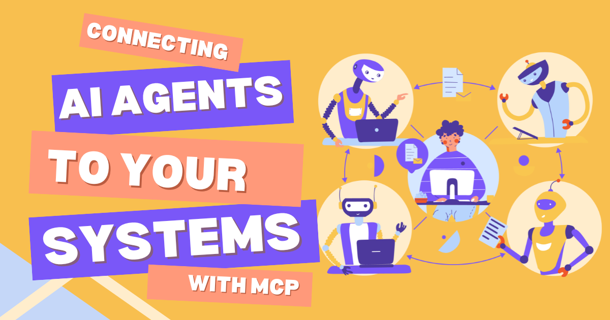
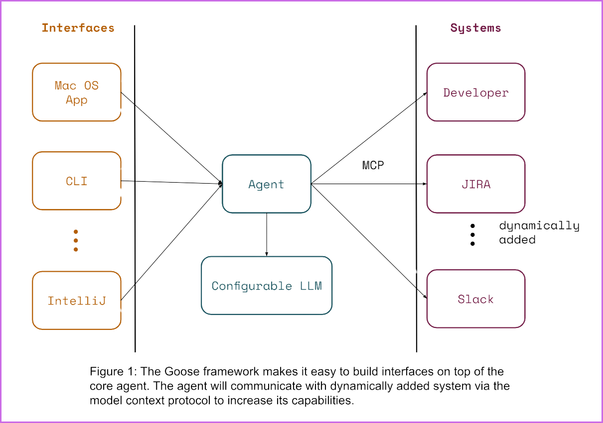

Open standards are a critical ingredient for interoperable systems. They have enabled most of the technologies that we all rely on. The ability to connect to the internet no matter where we are relies on open standards such as Wi-Fi, TCP/IP and DNS. When you receive an email in your Gmail account from an Outlook sender, it's the use of open standards like SMTP, IMAP, and POP3 that makes this seamless. One of the most transformative technologies of our lifetime - the internet - enables anyone to have their web page accessible to the entire world thanks to the HTTP and HTML standards.

We're in the early days of a new era in tech, one where companies are innovating and building practical AI solutions for the masses. To ensure the longevity of this technology, open standards will be essential in guiding the development of AI tools so that the diverse systems built by various companies can work together seamlessly.

<!-- more -->

### The MCP Open Standard

Anthropic is leading the charge with the [Model Context Protocol (MCP)](https://modelcontextprotocol.io), an open standard that enables large language model (LLM) applications to connect with external systems, providing the necessary context for more informed and relevant AI interactions. 

This is a game changer for AI agents such as [Goose](https://block.github.io/goose/), which can perform tasks autonomously - a significant leap beyond chatbots that only provide step-by-step instructions. However, to unlock the full potential of these AI agents, we need a standard method for connecting them to external data sources. MCP provides this foundation.

With MCP's standardized APIs and endpoints, Goose can integrate seamlessly into your systems, enhancing its ability to perform complex tasks like debugging, writing code, and running commands directly in your environment. 

### What's Possible

Without MCP, every [Goose toolkit](https://block.github.io/goose/plugins/using-toolkits.html) developer would need to implement bespoke integrations with every system they need to connect to. Not only is this tedious and repetitive, but it delays the fun stuff.

Let's take a simple GitHub workflow, for example. Goose interacts directly with the GitHub API using custom scripts or configurations. Developers must configure Goose to authenticate with GitHub and specify endpoints for actions like fetching open pull requests or adding comments. Each integration requires manual setup and custom coding to handle authentication tokens, error handling, and API updates.

MCP simplifies the process by providing a standardized interface for accessing GitHub as a resource. Goose, acting as an [MCP client](https://modelcontextprotocol.io/clients), requests the necessary information (e.g., list of open pull requests) from an [MCP server](https://modelcontextprotocol.io/quickstart#general-architecture) configured to expose GitHub's capabilities. The MCP server handles authentication and communication with GitHub, abstracting away the complexity of API interactions. Goose can then focus on tasks like providing a detailed review comment or suggesting code changes.

### Join the Ecosystem

As MCP adoption expands, so does Goose’s potential to deliver even more powerful solutions for your organization. By [integrating Goose](https://block.github.io/goose/) into your workflows and [embracing MCP](https://modelcontextprotocol.io/introduction), you’re not just enhancing your own systems, you’re contributing to the growth of an ecosystem that makes AI tools more interoperable, efficient, and impactful.