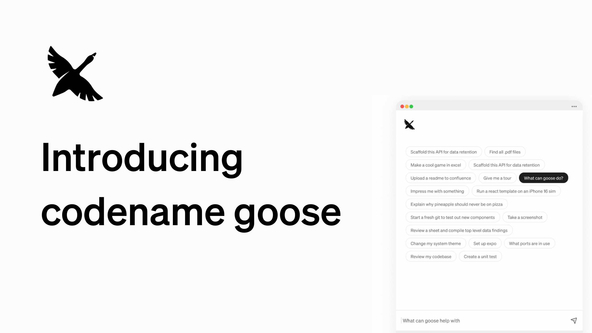

We are thrilled to announce **codename goose**, your on-machine developer agent built to automate your tasks. 

Powered by your choice of [large language models (LLMs)](/docs/getting-started/providers), a user-friendly interface & command-line, and [extensions](/docs/getting-started/using-extensions) that integrate with your existing tools and applications, Goose is designed to enhance your productivity and workflow.

<!--truncate-->

You can think of Goose as an assistant that is ready to take your instructions, and do the work for you.

While Goose's first use cases are engineering focused, the open source community have been exploring other non-engineering use cases for Goose as well. And it goes without saying, Goose is [Open Source](https://github.com/block/goose) 🎉.

## How Goose Works

Goose operates as an intelligent, autonomous agent capable of handling complex tasks through a well-orchestrated coordination of its core features:
  
- **Using Extensions**: Extensions are key to Goose’s adaptability, providing you the ability to connect with applications and tools that you already use. Whether it’s connecting to GitHub, accessing Google Drive or integrating with JetBrains IDEs, the possibilities are extensive. Some of these extensions have been curated in the [extensions](/extensions) directory. Goose extensions are built on the [Model Context Protocol (MCP)](https://www.anthropic.com/news/model-context-protocol) - enabling you to build or bring your own custom integrations to goose. 

- **LLM Providers**: Goose is compatible with a wide range of LLM providers, allowing you to choose and integrate your preferred model. Supported providers include OpenAI, Anthropic, and more, each offering unique capabilities to fit your needs.

- **CLI and Desktop Support**: You can have Goose running as both a desktop app or a command-line interface - whatever your preference is - using the same configuration across board.

## Getting Started

Getting up and running with Goose is easy:

1. **Installation**: Quickly install Goose using the setup guide in the [documentation](/docs/getting-started/installation.md).

2. **Configure Your Environment**: Choose your desired LLM provider and link necessary APIs or credentials directly via the Goose setup interface.

3. **Explore Extensions**: Browse and toggle between various built-in extensions to customize Goose to your workflow needs, or explore the [central directory of extensions](https://block.github.io/goose/v1/extensions) for additional options.

4. **Launch & Innovate**: Initiate a session and begin leveraging Goose's capabilities to tackle your tasks more efficiently than ever before.

## Conclusion

Goose is designed to be the bridge to a more intuitive, automated, and integrated workflow. Whether you’re battling demanding development tasks or managing multiplatform projects, Goose is your versatile, reliable assistant.

We invite you to experience Goose today and take the first step toward unlocking unparalleled productivity and creativity. Explore the possibilities with Goose and reshape the way you work!