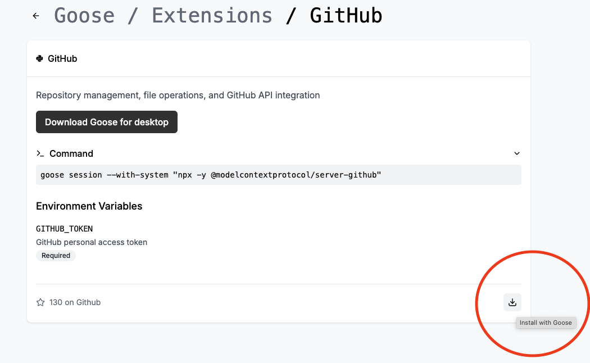
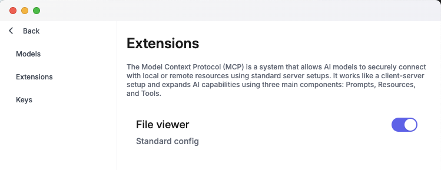

import Tabs from '@theme/Tabs';
import TabItem from '@theme/TabItem';

Goose Extensions are add-ons that provide are a way to extend the functionality of Goose. They also provide a way to connect Goose with applications and tools you already use in your workflow. These extensions can be used to add new features, automate tasks, or integrate with other systems.

### Built-in Extensions
Goose comes with a few built-in extensions that provide additional functionality. 

To see which extensions are available, you can run the following command:

```bash
goose system list
```

## Managing Extensions in Goose

### Discovering Extensions
Goose comes with a [central directory](https://silver-disco-nvm6v4e.pages.github.io/) of extensions that you can install and use. You can install extensions from the Goose CLI or from the Goose GUI.

You can also bring in any third-party extension of your choice using the [MCP server](https://github.com/modelcontextprotocol/servers) link as the `system_url`.


### Adding or Removing Extensions
<Tabs>
  <TabItem value="cli" label="Goose CLI" default>
    To add or remove an extension on Goose CLI, copy the extension URL and run the following command:

    **Add Extension**

    ```bash
    goose system add <system_url>
    ```

    **Remove Extension**

    ```bash
    goose system remove <system_url>
    ```
  </TabItem>
  <TabItem value="ui" label="Goose UI">

    Extensions can be installed directly from the directory to the Goose UI as shown below. 

    

    They can then be toggled on or off from the Extensions tab under settings.

    

  </TabItem>
</Tabs>

## Starting a Goose Session with Extensions

You can start a tailored goose session with specific extensions directly from the CLI. To do this, run the following command:

```bash
goose session --with-system "<system_url>"
```

:::note
You may need to set necessary environment variables for the extension to work correctly.
:::

## Developing Extensions
Goose extensions are implemented with the Model Context Protocol (MCP) - a system that allows AI models and agents to securely connect with local or remote resources using standard protocols. Learn how to build your own [extension as an MCP server](https://modelcontextprotocol.io/quickstart/server).