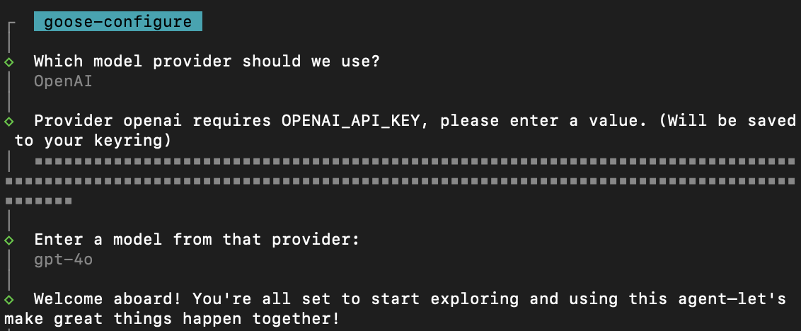

import Tabs from '@theme/Tabs';
import TabItem from '@theme/TabItem';

# Goose in 5 minutes

## Quickstart guide

Goose is a developer agent that supercharges your software development by automating an array of coding tasks directly in your terminal. This Quickstart guide will show you how to get started with Goose, whether you prefer using the command-line interface (CLI) or the desktop UI.

### Installation

<Tabs>
  <TabItem value="cli" label="Goose CLI" default>
    #### Installing the Goose CLI
    To install Goose, run the following script on macOS or Linux. 

    ```sh
    curl -fsSL https://github.com/block/goose/releases/download/stable/download_cli.sh | sh
    ```
    This script will fetch the latest version of Goose and set it up on your system.
  </TabItem>
  <TabItem value="ui" label="Goose UI">
    #### Installing the Goose UI

    To install the Goose desktop UI, follow these steps: 
    1. Visit the [Goose Releases page](https://github.com/block/goose/releases/tag/stable)
    2. Download the `Goose.zip` file.
    3. Open the downloaded `Goose.zip` file and launch the desktop application.
  </TabItem>
</Tabs>

### Running Goose

#### Set up a provider
Goose works with a set of [supported LLM providers][providers] that you can obtain an API key from if you don't already have one. You'll be prompted to set an API key if you haven't set one previously when you run Goose.

The process will look similar to the example below:

<Tabs>
  <TabItem value="cli" label="Goose CLI" default>
    
  </TabItem>
  <TabItem value="ui" label="Goose UI">
    
  </TabItem>
</Tabs>

:::info Billing
 You will need to have credits in your LLM Provider account (when necessary) to be able to successfully make requests. Some providers also have rate limits on API usage, which can affect your experience. Check out our [Handling Rate Limits][handling-rate-limits] guide to learn how to efficiently manage these limits while using Goose.
:::

#### Start a session
<Tabs>
    <TabItem value="cli" label="Goose CLI" default>
        From your terminal, navigate to the directory you'd like to start from and run:
        ```sh
        goose session 
        ```
    </TabItem>
    <TabItem value="ui" label="Goose UI">
        Starting a session in the Goose UI is straightforward. After choosing your provider, you’ll see the session interface ready for use.
        
        Type your questions, tasks, or instructions directly into the input field, and Goose will get to work immediately. 

        
    </TabItem>
</Tabs>

#### Make Goose do the work for you
You will see the Goose prompt `G❯`:

```
G❯ type your instructions here exactly as you would speak to a developer.
```

Here's an example:

```
G❯ Create a JavaScript project that fetches and displays weather for a user specified city using a public API
```

Now you are interacting with Goose in conversational sessions. Think of it like you're giving directions to a junior developer. The default toolkit allows Goose to take actions through shell commands and file edits. You can interrupt Goose with `CTRL+D` or `ESC+Enter` at any time to help redirect its efforts.

#### Exit the session

If you are looking to exit, use `CTRL+C`.

#### Resume a session

When you exit a session, it will save the history in `~/.config/goose/sessions` directory. You can then resume your last saved session later, using:

``` sh
goose session --resume
```

Check out the [Managing Goose sessions][managing-sessions] to learn more about working with sessions in Goose.


To see more documentation on the available CLI commands, check out the [CLI Commands Guide][cli]. If you’d like to develop your own CLI commands for Goose, check out the [Contributing document][contributing].


### Running a Goose task

You can run Goose to do things just as a one off, such as tidying up, and then exiting:

```sh
goose run instructions.md
```

You can also use process substitution to provide instructions directly from the command line:

```sh
goose run <(echo "Create a new Python file that prints hello world")
```

This will run until completion as best it can. You can also pass `--resume-session` and it will re-use the first session it finds for context.

### Extending Goose Functionality

Goose Extensions are add-ons utilizing [Anthropic's Model Context Protocol(MCP)][MCP], that enhance Goose's functionality by connecting it with different applications and tools you already use in your workflow. Extensions can be used to add new features, automate tasks, and integrate with other systems.

Goose includes both built-in and external extensions. To see the available built-in extensions, run:

```sh
goose system list
```
For details on adding, removing, or developing extensions, see the [Managing Goose Extensions Guide][extensions-guide].


**Goose as a Github Action**

There is also an experimental Github action to run Goose as part of your workflow (e.g., if you ask it to fix an issue):
https://github.com/marketplace/actions/goose-ai-developer-agent

## Additional tips

You can place a `.goosehints` file in `~/.config/goose/.goosehints` for hints personal to you. Goose will automatically load these within your sessions. For more tips and tricks to enhance your experience, check out the [Quick Tips Guide][quick-tips].


[handling-rate-limits]: https://block.github.io/goose/v1/docs/guidance/handling-llm-rate-limits-with-goose
[openai-key]: https://platform.openai.com/api-keys
[getting-started]: https://block.github.io/goose/guidance/getting-started.html
[providers]: https://block.github.io/goose/plugins/providers.html
[managing-sessions]: https://block.github.io/goose/guidance/managing-goose-sessions.html
[contributing]: https://block.github.io/goose/v1/docs/contributing
[quick-tips]: https://block.github.io/goose/v1/docs/guidance/tips
[extensions-guide]: https://block.github.io/goose/v1/docs/managing-extensions
[cli]: https://block.github.io/goose/v1/docs/plugins/cli
[goose-ui]: https://block.github.io/goose/v1/docs/plugins/cli
[MCP]: https://www.anthropic.com/news/model-context-protocol
